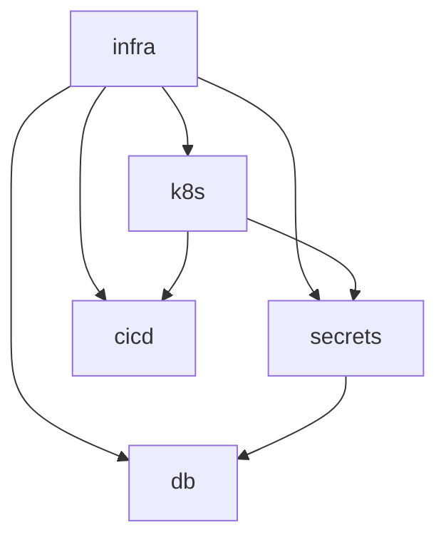
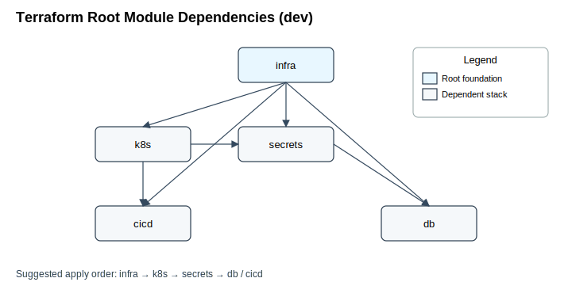

# Infrastructure as Code (IaC) for Oracle Cloud Infrastructure (OCI)

This repository provisions and composes OCI infrastructure (network, Kubernetes/OKE, MySQL DB, Vault-based secrets, and
CI/CD support) using Terraform. Each functional layer (infra, k8s, secrets, db, cicd, common) is isolated into its own
Terraform root module with its own remote state, enabling selective plan/apply operations and safe parallel evolution.

## High-Level Stack Overview

Stack (dir under `it-delivers-everywhere/oci/envs/dev`) : Purpose

- `infra` – Core networking (VCN, subnets, gateways) and base tenancy / region context
- `k8s` – OKE cluster, node pools, CSI drivers
- `secrets` – Vault, keys, secrets, policies (foundation for consumers like DB)
- `db` – MySQL DB system bound to private subnet and Vault secrets
- `cicd` – (Reserved / future) CI/CD related infra (e.g., build runners, artifact policies)
- `common` – Version pinning / shared meta (e.g., `versions.tf` that can be copied or referenced)

All state is stored in a single OCI Object Storage bucket with logical separation by object key prefix.

## Cross-Stack Dependency Graph

Visual representation of remote state consumption among Terraform root modules (dev environment):

Mermaid diagram (renders on GitHub):



Embedded SVG (exported to `docs/dependency-graph.svg`):



Apply order (topological): `infra → k8s → secrets → db / cicd`

Notes:

- `secrets` currently depends on both `infra` and `k8s`. If that coupling is unintended, remove the
  `data.terraform_remote_state.k8s` block from `secrets/backends.tf` (and any usages) to allow provisioning secrets
  earlier.
- `db` requires outputs from `secrets` (and transitively `infra`).
- `cicd` consumes infra and k8s only; it can be applied in parallel with `db` once prerequisites are satisfied.

## Repository Layout

```
it-delivers-everywhere/oci/
  init.sh                 # Creates & enables versioning for the Terraform state bucket
  envs/
    dev/
      infra/              # Root module: networking + base infra
      k8s/                # Root module: OKE cluster + node pools
      secrets/            # Root module: Vault, keys, secrets
      db/                 # Root module: MySQL + bindings to secrets + network
      cicd/               # Placeholder (add when needed)
      common/             # Shared versions or meta config (not a dependency boundary by itself)
```

## State & Backend Strategy

Each stack has its own `backends.tf` similar to:

```
terraform {
  backend "oci" {
    bucket    = "adt-terraform-state-buckets"
    namespace = "ax4chigfdisp"
    key       = "itde/oci/dev/infra/terraform.tfstate"
    workspace_key_prefix = "itde/oci/dev/infra"
  }
}
```

Key conventions:

- Bucket: single global bucket per tenancy/environment (`adt-terraform-state-buckets`)
- Key: `<product>/oci/<env>/<stack>/terraform.tfstate`
- No Terraform workspaces are required; path-based separation is clearer in OCI state buckets.

### Referencing Upstream State

Downstream stacks (e.g. `k8s`, `db`) access outputs from upstream stacks (`infra`, `secrets`) via
`data "terraform_remote_state"` blocks:

```
data "terraform_remote_state" "infra" {
  backend = "oci"
  config = {
    bucket    = "adt-terraform-state-buckets"
    namespace = "ax4chigfdisp"
    key       = "itde/oci/dev/infra/terraform.tfstate"
  }
}
```

Then consume: `data.terraform_remote_state.infra.outputs.vcn_id`.

Avoid redefining variables already produced as outputs (e.g., do NOT add a `var.cluster_ocid` if the k8s stack can
output it—export it from `k8s/outputs.tf` and import via remote state elsewhere).

## Module Sourcing Pattern

All custom modules are version pinned via Git tags using the `git::` prefix:

```
module "oci-infra" {
  source = "git::https://github.com/mdefenders/terraform-oci-infra.git?ref=v1.0.0"
  # ...inputs
}
```

Why `git::`? It explicitly tells Terraform to treat the source as a VCS module and allows using `?ref=` to pin a tag /
branch / commit.

## Environment Bootstrapping

Before the first `terraform init` of any stack, ensure the state bucket exists:

```
(cd it-delivers-everywhere/oci && ./init.sh)
```

`init.sh` will:

- Create the bucket if missing
- Enable versioning for state recovery / drift investigation

## Working With Individual Stacks

Example (provision networking first):

```
cd it-delivers-everywhere/oci/envs/dev/infra
terraform init
terraform plan -out=plan.out
terraform apply plan.out
```

Then provision dependent stacks (order matters):

1. infra
2. k8s
3. secrets
4. db (after secrets)
5. cicd (after k8s; can run parallel to db once prereqs met)

## Adding a New Stack

1. Copy a minimal skeleton (`versions.tf`, `backends.tf`, `providers.tf`, `variables.tf`, `outputs.tf`).
2. Choose a unique key path: `itde/oci/dev/<new-stack>/terraform.tfstate`.
3. Expose any cross-stack values through `outputs.tf`; never have downstream consumers guess or recompute them.
4. Document dependencies at the top of `main.tf` with a short comment block.

## Common Gotchas & Resolutions

| Issue                                                                            | Cause                                                  | Fix                                                                                                      |
|----------------------------------------------------------------------------------|--------------------------------------------------------|----------------------------------------------------------------------------------------------------------|
| Terraform asks for var that should come from another stack (e.g. `cluster_ocid`) | Variable declared instead of using remote state output | Add an output in source stack; remove variable; add `data terraform_remote_state` block                  |
| State key mis-typed                                                              | Backends mismatch actual object path                   | Verify `key` matches Bucket/Object path exactly                                                          |
| Permission error copying or reading state                                        | OCI policy lacks required ObjectStorage verbs          | Grant `ALLOW group <group-name> to read,manage object-family in compartment <compartment>` appropriately |
| Duplicate attributes (e.g., repeated `bucket` line)                              | Manual copy/paste                                      | Remove the duplicate line; run `terraform init -reconfigure`                                             |

## Copying or Renaming State Objects

OCI Object Storage does not implicitly treat path-like names as folders; they are object keys. To copy a state file (
example: consolidating naming):

```
oci os object copy \
  --bucket-name adt-terraform-state-buckets \
  --source-object itde/oci/dev/db/terraform.tfstate \
  --destination-namespace ax4chigfdisp \
  --destination-bucket adt-terraform-state-buckets \
  --destination-object itde/oci/dev/db/terraform.tfstate.bak
```

If you originally stored a state at `itde/oci/dev/db` (without the trailing filename) and need it at
`itde/oci/dev/db/terraform.tfstate`, download and re-upload or use copy with the correct source key.

## YAML / Helm Value Notes

If you manage Helm values referencing Terraform-generated strings, wildcard semver constraints should generally be
quoted for clarity:

```
chartVersion: "0.1.*"
```

Quoting prevents YAML parsers or downstream tooling from misinterpreting the `*`. If a linter auto-added quotes, it is
usually safe and correct.

## ApplicationSet Variable Substitution

When embedding Terraform variables inside YAML templates rendered by Terraform, ensure interpolation contexts do not
clash. Example in a Terraform `templatefile` or heredoc:

```
- name: ${var.appset_name}
```

If a Helm or ArgoCD template engine also processes `{{ ... }}` then keep Terraform interpolation distinct. For adding
more vars (e.g., `github_org`, `chart_repo`, `chart_name`, `chart_version`), declare them in `variables.tf`, set them in
`terraform.tfvars`, and reference similarly:

```
repo: ${var.github_org}/${var.chart_repo}
chart: ${var.chart_name}
version: ${var.chart_version}
```

## Security & Access Highlights

- State bucket has versioning enabled (recover from accidental deletes / corruption)
- Network segregation: public vs private subnets, NAT + Internet + Service gateways
- Secrets isolated via Vault; DB root password stored as a secret (never hard-coded)
- Principle of least privilege recommended: refine compartment structure over time

## Troubleshooting Quick Reference

| Symptom              | Command to Diagnose                        | Next Step                          |
|----------------------|--------------------------------------------|------------------------------------|
| Backend auth failure | `terraform init -reconfigure -input=false` | Re-check OCI config / API key      |
| Missing output       | `terraform output -state=...`              | Add output block to upstream stack |
| Object copy fails    | Add `--debug` to `oci os object copy`      | Adjust IAM policy / object name    |

## Known Weaknesses / Technical Debt

- Control plane exposure not yet fully restricted
- Ingress controller choices limited; using NGINX
- Initial compartment strategy coarse-grained (room for fine-grained RBAC)

## License

MIT

---
Generated & maintained for an OCI-centric multi-stack Terraform workflow. Contributions welcome.
